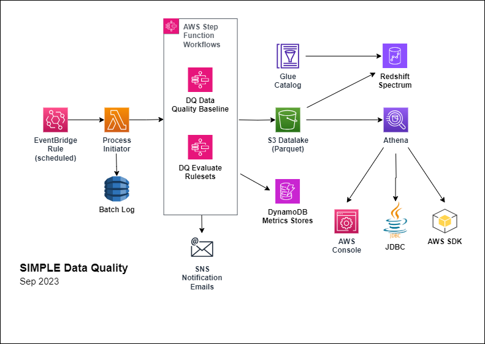
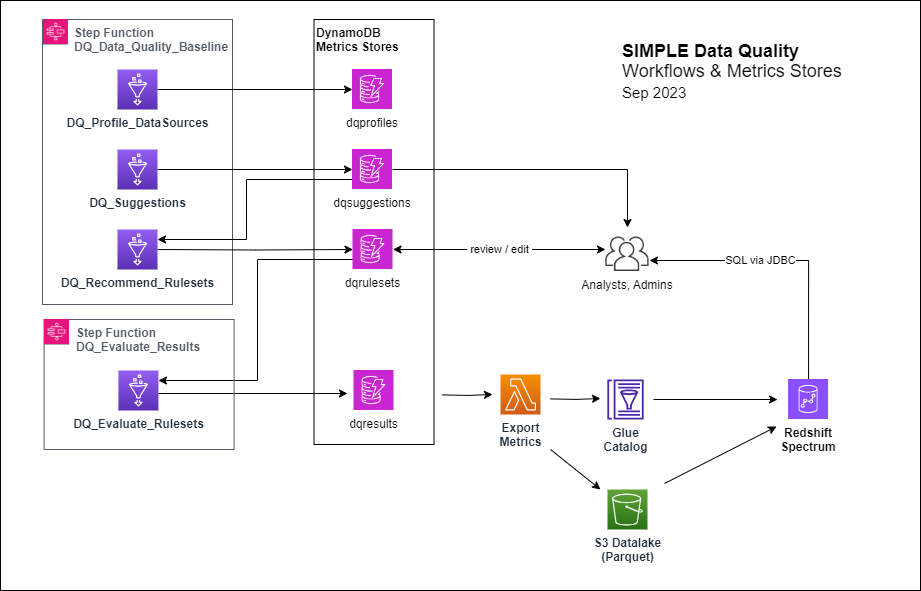

# SIMPLE Data Quality
This project demonstrates how to use [PyDeequ](https://github.com/awslabs/python-deequ) and [Glue ETL](https://aws.amazon.com/glue/) to define, execute, and manage data quality processes utlizing AWS Serverless Computing technologies.   PyDeequ is an open-source Python wrapper over [Deequ](https://github.com/awslabs/deequ) which is an open-source tool developed and used at Amazon. PyDeequ allows us to use its data quality and testing capabilities from Python and PySpark, the language of choice of many data scientists.  Although developed by and for AWS, many of these tools and concepts can be applied to any Spark plaform.

AWS has integrated the DeeQu framework with its [Glue Data Catalog](https://docs.aws.amazon.com/glue/latest/dg/catalog-and-crawler.html) and [Glue ETL](https://aws.amazon.com/glue/) services, both of which are being utilized in our [file ingest pipeline](https://github.com/froghollow/simple-file-processing). 
 Glue Data Quality provides flexible interfaces via the Glue Management Console, APIs, and the [Data Quality Definition Language (DQDL)](https://docs.aws.amazon.com/glue/latest/dg/dqdl.html).   DQDL provides a simple declarative syntax for defining data quality rules, which are then executed by a common Glue ETL service.  This makes data quality more approachable for non-coders, and is easier to maintain than a set of Glue ETL jobs for every ruleset which need to go thru SDLC for adding or modifying rules.  

AWS Glue Data Quality currently available only on Commercial Regions, not yet on GovCloud.   DQDL exposes only a subset of (Py)DeeQu features.  This project provides an alternative solution implemented using PyDeequ within Glue ETL jobs, with consideration to potentially support transition to standard boto3 API if/when Glue Data Quality becomes available on GovCloud.

- Baselines performed periodically (monthly, quarterly?) on PARQUET full data extracts 

  -  Step Function [DQ_Data_Quality_Baseline](./stepfunctions/DQ_Data_Quality_Baseline.json) executes a set of Glue ETL jobs against a Batch of full datasets
      - [DQ_Profile_DataSources](./glue/DQ_Profile_DataSources.py) stored in DynamoDB table dqprofiles
      - [DQ_Suggestions](./glue/DQ_Suggestions.py) stored in DynamoDB table dqsuggestions
      - [DQ_Recommend_Rulesets](./glue/DQ_Recommend_Rulesets.py) transforms dqsuggestions into default dqrulesets for each dataset.
        - Default Rulesets should be reviewed and edited by an Analyst or Admin.  
   
- Ruleset Evaluations are performed on daily inputs to evaluate each file's compliance with the specified Ruleset.
  - EventBridge Rule DQ.EVALRULES.DAILY initiates Step Function [DQ_Evaluate_Rulesets](./stepfunctions/DQ_Evaluate_Rulesets.json) to run a Glue ETL job for a Batch of daily files in order to evaluate results for each dataset.
  - Results are tallied and scored to provide and overall assessment of the dataset
  - Results are stored in DynamoDB table dqresults
  
- SIMPLE File Processing Integration
  - Data Quality Glue ETL jobs log results into the DynamoDB batch table, same as the [SIMPLE File Processing](https://github.com/froghollow/simple-file-processing) routines.  
  - DQ Step Functions evaluate DQ Batch Status and send SNS notifications
    - Subscribe to SNS Topic [Batch_Status]() for DDMAP File Processing and Data Quality email notifications 
  - DQ Step Functions are separate for now, but can easily integrate DQ Steps into File Processing workflows

- Glue Catalog & Redshift Spectrum Integration
  - Lambda function  exports flattened versions of each of the DynamoDB tables into PARQUET datasets, cataloged in Glue database, accessible via Redshift Spectrum schema
    - *-latest* tables catalog only the most-recent dataset
    - *-series* tables catalog all datasets to support time series, which enables us to understand trends or patterns over time.
